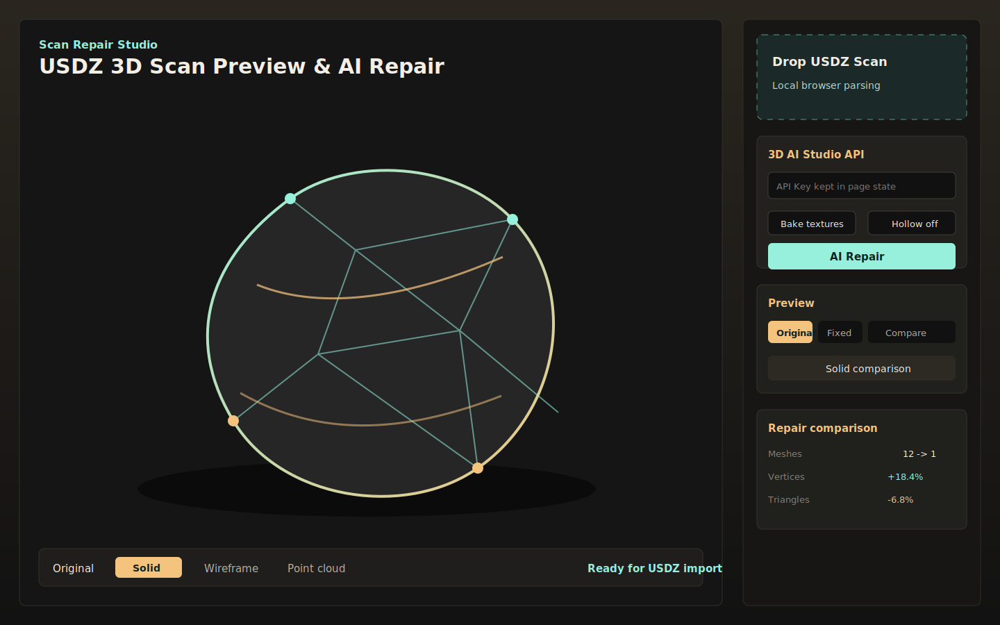

# Scan Repair Studio

Scan Repair Studio is a local web prototype for previewing iPhone LiDAR / 3D Scanner `.usdz` captures and sending them to a third-party 3D mesh repair service. It focuses on the practical MVP path:

```text
Import USDZ -> Preview original model -> Convert to GLB -> Repair via API -> Preview repaired model
```

The app is currently designed for local use. Imported scan files stay in the browser until the user explicitly starts a repair task.



## Features

- Drag-and-drop `.usdz` import.
- Three.js preview for the original scan.
- Solid, wireframe, and point-cloud render modes.
- Original, repaired, side-by-side, and difference views.
- Frontend USDZ-to-GLB conversion before upload.
- Vite dev-server proxy for 3D AI Studio API calls.
- Repair result statistics: mesh, vertex, triangle, and delta comparison.
- API Key input kept in page state only; no key is committed to the repo.

## Requirements

- Node.js 20.19+ or 22.12+.
- npm.
- A valid 3D AI Studio API Key with available credits.

DeepSeek, OpenAI, or other text-model keys will not work for mesh repair. This project calls the 3D AI Studio Mesh Repair API.

## Quick Start

```bash
npm install
npm run dev -- --host 127.0.0.1 --port 5173
```

Open:

```text
http://127.0.0.1:5173/
```

## Usage

1. Import a `.usdz` file generated by an iPhone 3D scanning app.
2. Inspect the original model in solid, wireframe, or point-cloud mode.
3. Enter a 3D AI Studio API Key.
4. Keep `Bake textures` enabled for visual preview workflows.
5. Keep `Hollow` disabled unless preparing a model for 3D printing.
6. Click `AI Repair`.
7. Compare the original and repaired models in solid side-by-side view.

See [docs/USAGE.md](docs/USAGE.md) for more detail.

## API Proxy

The browser does not call 3D AI Studio directly. Vite runs a same-origin development proxy:

- `POST /api/3dai/repair`
- `GET /api/3dai/status/{task_id}`
- `GET /api/3dai/asset?url={encoded_asset_url}`

The proxy forwards requests to:

- `POST https://api.3daistudio.com/v1/tools/repair/`
- `GET https://api.3daistudio.com/v1/generation-request/{task_id}/status/`

See [docs/ARCHITECTURE.md](docs/ARCHITECTURE.md) for the data flow and deployment notes.

## Important Limits

- This is mesh repair/remesh, not semantic point-cloud completion.
- If the original model already renders cleanly, the repaired solid preview can look nearly identical.
- The best proof of repair is often in topology stats, wireframe, normals, and watertightness rather than visible surface changes.
- The current proxy lives in the Vite dev server. A production deployment needs a backend or serverless function for the same proxy behavior.
- USDZ compatibility still depends on how the source scanning app exports the file.

## Scripts

```bash
npm run dev      # Start Vite dev server
npm run build    # Type-check and build production assets
npm run preview  # Preview the production build locally
```

## Project Structure

```text
src/App.tsx                  Main UI and repair workflow
src/components/Viewer.tsx    Three.js viewer and comparison modes
src/lib/usdz.ts              USDZ loading and normalization
src/lib/exportGlb.ts         GLB export before API upload
src/lib/repairApi.ts         Frontend repair API client
src/lib/loadGlb.ts           Repaired GLB loading
vite.config.ts               Vite config and 3D AI Studio proxy
docs/                        Usage and architecture docs
```

## License

No open-source license has been selected yet. Public visibility does not grant reuse rights unless a license is added.
