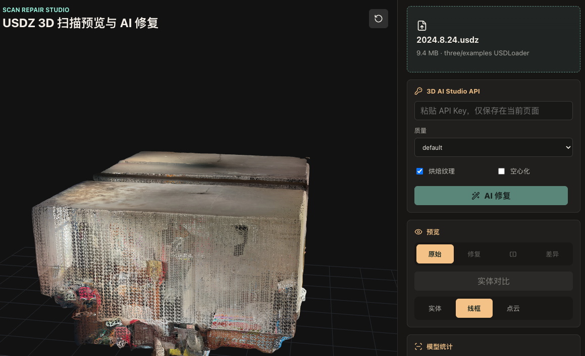

# Scan Repair Studio

Scan Repair Studio 是一个本地 Web 原型，用于预览 iPhone LiDAR / 3D Scanner 导出的 `.usdz` 扫描文件，并通过第三方 3D 网格修复服务生成修复后的模型。

核心流程：

```text
导入 USDZ -> 预览原始模型 -> 转换为 GLB -> 调用修复 API -> 预览修复结果
```

当前版本面向本地使用。导入的扫描文件会先留在浏览器本地，只有用户点击「AI 修复」时，才会把前端转换出的 GLB 上传到 3D AI Studio Mesh Repair API。



## 功能特性

- 支持拖拽或选择 `.usdz` 文件。
- 使用 Three.js 预览原始 3D 扫描模型。
- 支持实体、线框、点云三种渲染模式。
- 支持原始、修复、实体对比、差异叠加等预览模式。
- 前端将 USDZ 场景转换为 GLB 后再上传修复。
- 通过 Vite 本地同源代理转发 3D AI Studio API 请求，避免浏览器 CORS 问题。
- 显示修复前后的 Mesh、顶点、三角面数量及变化。
- API Key 只保存在当前页面状态中，不写入代码或本地文件。

## 环境要求

- Node.js 20.19+ 或 22.12+。
- npm。
- 一个有效且有额度的 3D AI Studio API Key。

DeepSeek、OpenAI 或其他文本大模型的 API Key 不能用于这里的模型修复。本项目调用的是 3D AI Studio 的 Mesh Repair API，不是文本生成接口。

## 快速开始

```bash
npm install
npm run dev -- --host 127.0.0.1 --port 5173
```

打开：

```text
http://127.0.0.1:5173/
```

## 使用方式

1. 导入 iPhone 3D 扫描 App 生成的 `.usdz` 文件。
2. 在页面中查看原始模型，可切换实体、线框或点云模式。
3. 输入 3D AI Studio API Key。
4. 普通展示场景建议开启「烘焙纹理」。
5. 非 3D 打印场景建议关闭「空心化」。
6. 点击「AI 修复」。
7. 修复完成后，在实体对比视图中查看原始模型与修复模型。

更详细的操作说明见 [docs/USAGE.md](docs/USAGE.md)。

## API 代理

浏览器不直接访问 3D AI Studio，而是先请求 Vite 本地同源代理：

- `POST /api/3dai/repair`
- `GET /api/3dai/status/{task_id}`
- `GET /api/3dai/asset?url={encoded_asset_url}`

代理再转发到：

- `POST https://api.3daistudio.com/v1/tools/repair/`
- `GET https://api.3daistudio.com/v1/generation-request/{task_id}/status/`

数据流和部署注意事项见 [docs/ARCHITECTURE.md](docs/ARCHITECTURE.md)。

## 重要限制

- 当前的「AI 修复」是 mesh repair / remesh，不是语义级点云补全。
- 如果原始模型本身已经能正常渲染，修复后的实体外观可能和原图非常接近。
- 修复效果往往体现在拓扑、法线、松散面、封闭性和三角面结构上，而不一定是肉眼可见的大幅外观变化。
- 当前代理只运行在 Vite 开发服务里；如果要正式部署，需要把 `/api/3dai/*` 代理逻辑放到后端或 Serverless Function。
- USDZ 兼容性取决于具体扫描 App 的导出方式。

## 常用命令

```bash
npm run dev      # 启动本地开发服务
npm run build    # 类型检查并构建生产产物
npm run preview  # 本地预览生产构建
```

## 项目结构

```text
src/App.tsx                  主界面和修复流程
src/components/Viewer.tsx    Three.js 预览器和对比视图
src/lib/usdz.ts              USDZ 加载与模型归一化
src/lib/exportGlb.ts         上传前导出 GLB
src/lib/repairApi.ts         前端修复 API 客户端
src/lib/loadGlb.ts           加载修复后的 GLB
vite.config.ts               Vite 配置与 3D AI Studio 代理
docs/                        使用说明和架构文档
```

## 许可证

暂未选择开源许可证。仓库公开并不代表授予复用权利；如需开源复用，请先补充明确的 LICENSE 文件。
